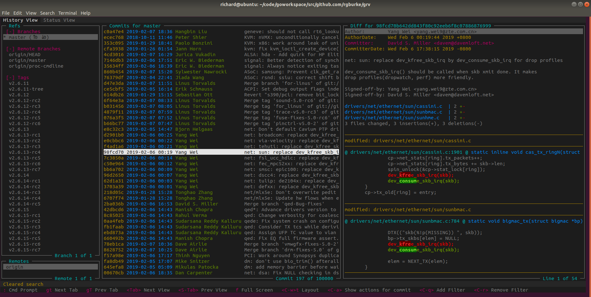

# GRV - Git Repository Viewer [](https://travis-ci.org/rgburke/grv)

GRV is a terminal based interface for viewing git repositories. It allows
refs, commits and diffs to be viewed, searched and filtered. The behaviour
and style can be customised through configuration. A query language can
be used to filter refs and commits, see the [Documentation](#documentation)
section for more information.



More screenshots can be seen [here](doc/screenshots.md)

## Features

 - Commits and refs can be filtered using a query language.
 - Changes to the repository are captured by monitoring the filesystem allowing the UI to be updated automatically.
 - Organised as tabs and splits. Custom tabs and splits can be created using any combination of views.
 - Vi like keybindings by default, key bindings can be customised.
 - Custom themes can be created.

## Documentation

Documentation for GRV is available [here](doc/documentation.md)

## Download

Static binaries are available for Linux (amd64 and arm32). For example, to use
the amd64 binary run the following steps:

```
wget -O grv https://github.com/rgburke/grv/releases/download/v0.1.2/grv_v0.1.2_linux64
chmod +x ./grv
./grv -repoFilePath /path/to/repo
```

## Build instructions

Go version 1.5 or later is required. GRV depends on the following libraries:

 - libncursesw
 - libreadline
 - libcurl
 - cmake (to build libgit2)

Building GRV on OSX requires homebrew, and for `readline`, `pkg-config`, and `cmake` to be installed using homebrew:

```
brew install readline pkg-config cmake
```

To install GRV run:

```
go get -d github.com/rgburke/grv/cmd/grv
cd $GOPATH/src/github.com/rgburke/grv
make install
```

`grv` is currently an alias used by oh-my-zsh. To install grv with an alternative
binary name that doesn't conflict with this alias, change the last
step to:

```
make install BINARY=NewBinaryName
```

where `NewBinaryName` is the alternative name to use instead.
Alternatively `unalias grv` can be added to the end of your `.zshrc` if you do
not use the `grv` alias.

The steps above will install GRV to `$GOPATH/bin`. A static libgit2 will be built and
included in GRV when built this way. Alternatively if libgit2 0.25 is
installed on your system GRV can be built normally:

```
go install ./cmd/grv
```
